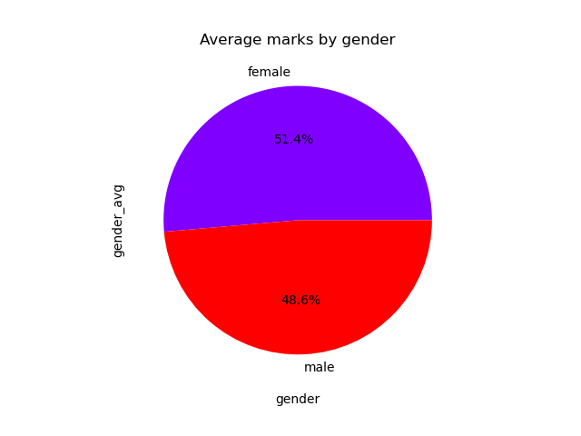
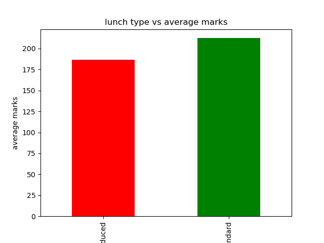

# students-performance-analyzer
Student performance analysis project using Python, Pandas, Matplotlib, and Seaborn with data visualization and insights.

This project analyzes student exam performance using Python, Pandas, Matplotlib, and Seaborn.

## Features
- Gender analysis
- Parent education analysis
- Lunch impact analysis
- Histogram visualization
- Heatmaps
- Boxplots

## Technologies Used
- Python
- Pandas
- Matplotlib
- Seaborn

## Dataset
StudentsPerformance.csv

## 📊 Sample Visualizations

### Gender Chart

### Lunch Impact Analysis

